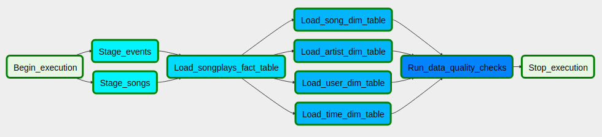
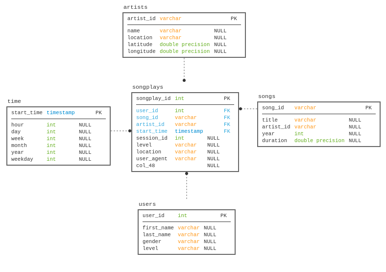

# Data Pipelines

This is the solution to the project **Data Pipelines** of Udacity's [Data Engineering Nanodegree](https://www.udacity.com/course/data-engineer-nanodegree--nd027).


## Introduction

The purpose of this project is to build an ETL pipeline using an Airflow DAG in order to extract data from an S3 bucket, stage them in Redshift and then write in Redshift tables using a star schema. The resulting tables are meant to be able to provide fast queries to analyze song play data from the startup Sparkify.

## Resources

* `create_cluster.py` is a script to create a Redshift cluster (and everything else necessary) using the provided credentials in the `dwh.cfg` file.
* `delete_cluster.py` is a script to delete the Redshift cluster and remove the role created to access S3 buckets.
* `create_tables.py` is a script to (re)create the staging tables and the fact and dimension tables for the star schema in Redshift.
* * `sql_queries.py` is used to define the SQL statements which will be imported into `create_tables.py` file.
* `docker-compose.yml` is a docker-compose file to create an Airflow container and its Postgres database so it can be used for local development.
* `airflow/dags/etl.py` is a DAG file to load data from S3 into the staging tables on Redshift and then processes that data into the analytics tables.
* The `dwh.cfg` file should have the following structure and its values must be filled in.

```ini
[AWS]
KEY=
SECRET=

[CLUSTER] 
CLUSTER_TYPE=multi-node
NUM_NODES=4
NODE_TYPE=dc2.large

IAM_ROLE_NAME=
CLUSTER_IDENTIFIER=
HOST=
DB_NAME=
DB_USER=
DB_PASSWORD=
DB_PORT=

[IAM_ROLE]
ARN=
```

## Executing the ETL process

* The `etl` DAG is scheduled to run every hour and uses 4 custom operators, each with its own responsibilities:

  * `DummyOperator` does not execute anything and is used only to mark the beginning and the end of the DAG.
  * `StageToRedshiftOperator` is used to execute a `COPY` statement on Redshift, copying data from a S3 bucket and inserting them in a table.
  * `LoadFactOperator` is an operator that receives a `select` statement used as a data source and a target table to insert the data into.
  * `LoadDimensionOperator` works the same way as the `LoadFactOperator`, except it has an extra parameter, `truncate_before_load`, used to indicate if the dimension table needs to be truncated before loading the new data.
  * `DataQualityOperator` is used to run data validation tests on the inserted tables. It takes queries and results as parameters. If the result of the corresponding query does not match the expected result, the operator raises an exception.

* The DAG is composed of 10 tasks which are:

  * `Begin_execution` - `DummyOperator`
  * `Stage_events` copies the data in the `log_data` folder of the `udacity-dend` bucket and inserts in the `stg_events` table.
  * `Stage_songs` copies the data in the `songs_data` folder of the `udacity-dend` bucket and inserts in the `stg_songs` table.
  * `Load_songplays_fact_table` uses both `stg_songs` and `stg_events` tables to insert data into the `songplays` table.
  * `Load_song_dim_table` uses the `stg_songs` table to insert data into the `songs` table.
  * `Load_artist_dim_table` uses the `stg_songs` table to insert data into the `artists` table.
  * `Load_user_dim_table` uses the `stg_events` table to insert data into the `users` table.
  * `Load_time_dim_table` uses the `songplays` table to insert data into the `songs` table.
  * `Run_data_quality_checks` runs several queries to check if there really are no null values in columns that should be always populated.



## Data Model

The data model chosen to represent the data processed by the ETL is the following:




